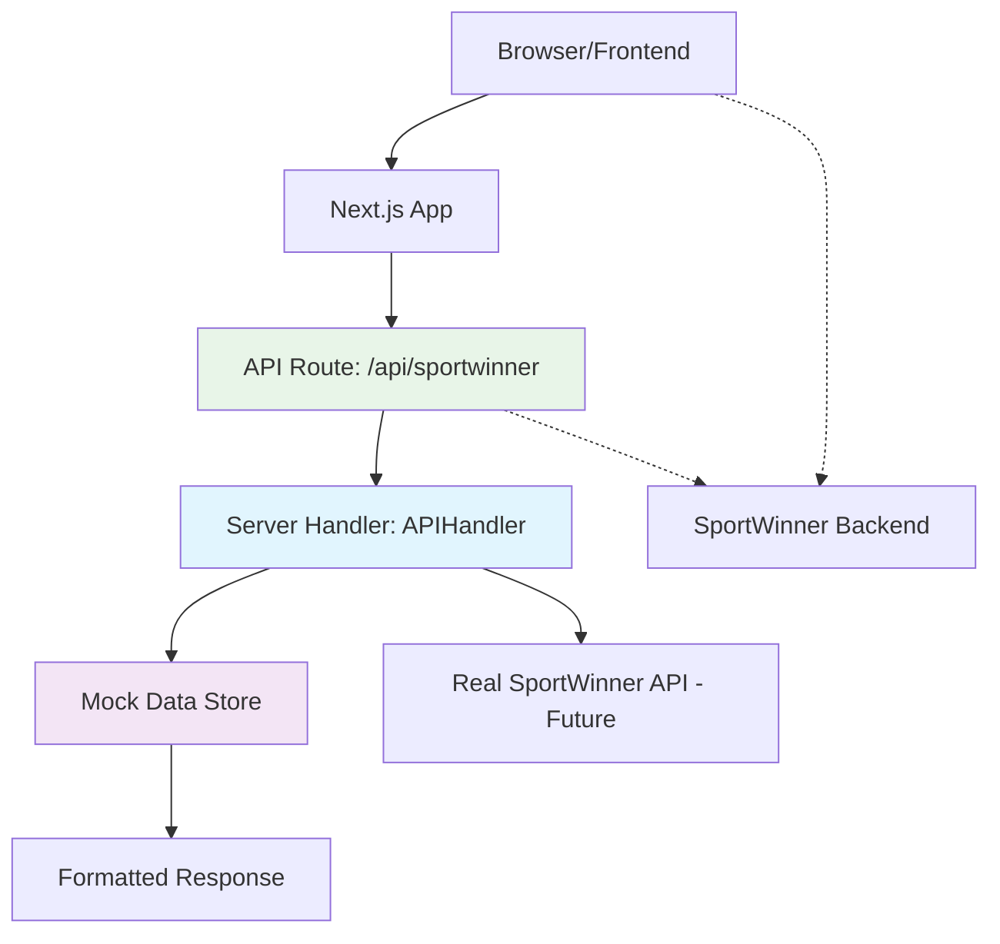
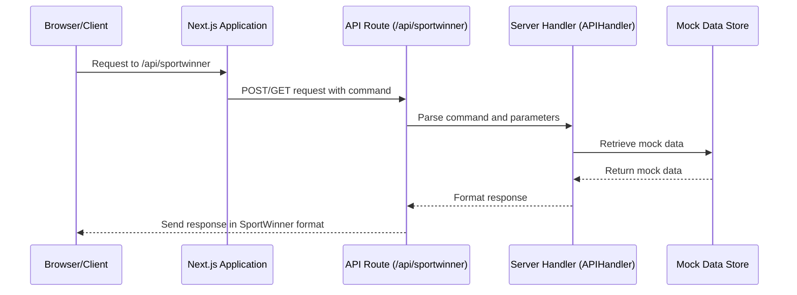
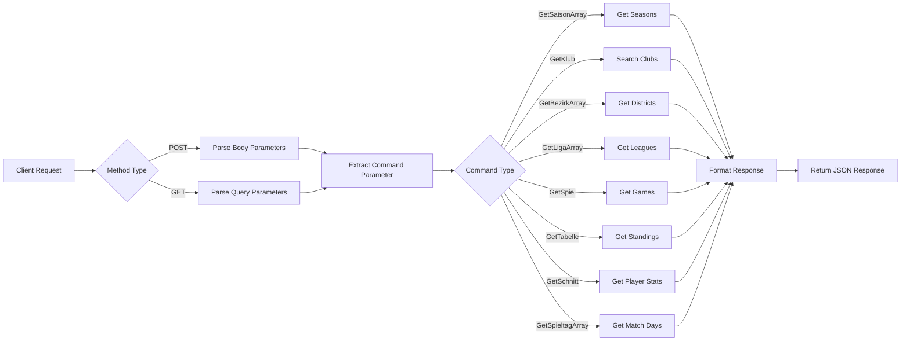

# API Documentation for Kegel Website

## Table of Contents
1. [Overview](#overview)
2. [Architecture Diagram](#architecture-diagram)
3. [API Paths Visualization](#api-paths-visualization)
4. [Current Implementation](#current-implementation)
5. [API Endpoints](#api-endpoints)
6. [JSON API Schema](#json-api-schema)
7. [How to Edit and Extend the API](#how-to-edit-and-extend-the-api)
8. [Best Practices](#best-practices)
9. [Testing](#testing)

## Overview

This document describes the API management system for the Kegel (bowling/kegeln) website. The API acts as a proxy to the SportWinner backend service, which provides data about seasons, clubs, leagues, games, and standings for German kegeln associations.

The API follows RESTful principles with a proxy pattern, intercepting requests originally destined for `https://skvb.sportwinner.de/php/skvb/service.php` and returning mock/example data that matches the SportWinner API format.

## Architecture Diagram



### Component Flow



## API Paths Visualization

### Main API Structure

```mermaid
graph TD
    A[API Root: /api/sportwinner] --> B[POST Request]
    A --> C[GET Request]
    
    B --> B1[Command Parameter]
    C --> C1[Command Query Parameter]
    
    B1 --> B11[GetSaisonArray]
    B1 --> B12[GetKlub]
    B1 --> B13[GetBezirkArray]
    B1 --> B14[GetLigaArray]
    B1 --> B15[GetSpiel]
    B1 --> B16[GetTabelle]
    B1 --> B17[GetSchnitt]
    B1 --> B18[GetSpieltagArray]
    
    C1 --> C11[GetSaisonArray]
    C1 --> C12[GetKlub]
    C1 --> C13[GetBezirkArray]
    C1 --> C14[GetLigaArray]
    C1 --> C15[GetSpiel]
    C1 --> C16[GetTabelle]
    C1 --> C17[GetSchnitt]
    C1 --> C18[GetSpieltagArray]
    
    B11 --> B111[Response: Season Array]
    B12 --> B121[Response: Club Array]
    B13 --> B131[Response: District Array]
    B14 --> B141[Response: League Array]
    B15 --> B151[Response: Game Array]
    B16 --> B161[Response: Standings Array]
    B17 --> B171[Response: Player Stats Array]
    B18 --> B181[Response: Matchday Array]
    
    C11 --> C111[Response: Season Array]
    C12 --> C121[Response: Club Array]
    C13 --> C131[Response: District Array]
    C14 --> C141[Response: League Array]
    C15 --> C151[Response: Game Array]
    C16 --> C161[Response: Standings Array]
    C17 --> C171[Response: Player Stats Array]
    C18 --> C181[Response: Matchday Array]
```



### API Request Flow



## Current Implementation

The API is implemented using the following components:

### 1. Server Handler (`server/api-handler.ts`)
- Contains the `APIHandler` class with methods for each SportWinner API command
- Provides mock data for all API endpoints
- Interfaces with the SportWinner API format while abstracting the implementation
- Implements proper error handling and logging

### 2. API Route (`app/api/sportwinner/route.ts`)
- Next.js API route that handles POST and GET requests
- Parses commands from request body or query parameters
- Routes requests to appropriate methods in the APIHandler
- Formats responses to match SportWinner API format
- Implements proper HTTP status codes

### 3. Data Structures
- Types defined for Seasons, Clubs, Districts, Leagues, and Players
- Consistent data structures that match the SportWinner API format
- Easy to extend for additional fields or entities

## API Endpoints

### Base Endpoint
`POST /api/sportwinner` or `GET /api/sportwinner`

### Supported Commands

#### 1. GetSaisonArray
- **Purpose**: Retrieve available seasons
- **Method**: POST or GET
- **Parameters**: None
- **Response**: Array of seasons with ID, year, and status
- **Example Response**: `[["11", 2025, 0], ["10", 2024, 1]]`
- **HTTP Status**: 200 OK

#### 2. GetKlub
- **Purpose**: Search for clubs by name or number
- **Method**: POST or GET
- **Parameters**: `name_klub` (optional), `nr_klub` (optional)
- **Response**: Array of club information
- **Example Response**: `[["1", "001", "BSV GW Friedrichshain"]]`
- **HTTP Status**: 200 OK

#### 3. GetBezirkArray
- **Purpose**: Get districts/regions for the selected season
- **Method**: POST or GET
- **Parameters**: `id_saison`
- **Response**: Array of districts
- **Example Response**: `[["1", "Berlin"], ["2", "Brandenburg"]]`
- **HTTP Status**: 200 OK

#### 4. GetLigaArray
- **Purpose**: Get leagues for the selected season and district
- **Method**: POST or GET
- **Parameters**: `id_saison`, `id_bezirk`, `favorit`, `art`
- **Response**: Array of league information with contact details
- **Example Response**: `[["1", "Liga 1", "Bezirksliga Berlin", ...]]`
- **HTTP Status**: 200 OK

#### 5. GetSpiel
- **Purpose**: Get games for the selected criteria
- **Method**: POST or GET
- **Parameters**: `id_saison`, `id_klub`, `id_bezirk`, `id_liga`, `id_spieltag`, `favorit`, `art_bezirk`, `art_liga`, `art_spieltag`
- **Response**: Array of game information
- **Example Response**: `[["1", "2025-01-15", "19:00", ...]]`
- **HTTP Status**: 200 OK

#### 6. GetTabelle
- **Purpose**: Get league standings
- **Method**: POST or GET
- **Parameters**: `id_saison`, `id_liga`, `nr_spieltag`, `sort`
- **Response**: Array of team standings
- **Example Response**: `[["1", "1", "BSV GW Friedrichshain", ...]]`
- **HTTP Status**: 200 OK

#### 7. GetSchnitt
- **Purpose**: Get player statistics/scores
- **Method**: POST or GET
- **Parameters**: `id_saison`, `id_liga`, `id_klub`, `nr_spieltag`, `sort`, `anzahl`
- **Response**: Array of player statistics
- **Example Response**: `[[1,"Böse, Stefan","BSV GW Friedrichshain",...]]`
- **HTTP Status**: 200 OK

#### 8. GetSpieltagArray
- **Purpose**: Get all match days for a league
- **Method**: POST or GET
- **Parameters**: `id_saison`, `id_liga`
- **Response**: Array of match day information
- **Example Response**: `[["98869", "1", "1. Spieltag", "1"]]`
- **HTTP Status**: 200 OK

## JSON API Schema

The API also provides a schema endpoint that returns the API structure in JSON format.

### Schema Endpoint
`GET /api/sportwinner/schema`

### Response Format
```json
{
  "openapi": "3.0.0",
  "info": {
    "title": "SportWinner Kegel API",
    "description": "API for accessing SportWinner kegel data",
    "version": "1.0.0"
  },
  "paths": {
    "/api/sportwinner": {
      "post": {
        "summary": "Execute SportWinner command",
        "parameters": [
          {
            "name": "command",
            "in": "query",
            "required": true,
            "type": "string",
            "enum": ["GetSaisonArray", "GetKlub", "GetBezirkArray", "GetLigaArray", "GetSpiel", "GetTabelle", "GetSchnitt", "GetSpieltagArray"]
          }
        ],
        "responses": {
          "200": {
            "description": "Success response in SportWinner format"
          },
          "400": {
            "description": "Bad request - missing command parameter"
          },
          "500": {
            "description": "Internal server error"
          }
        }
      },
      "get": {
        "summary": "Execute SportWinner command (GET)",
        "parameters": [
          {
            "name": "command",
            "in": "query",
            "required": true,
            "type": "string",
            "enum": ["GetSaisonArray", "GetKlub", "GetBezirkArray", "GetLigaArray", "GetSpiel", "GetTabelle", "GetSchnitt", "GetSpieltagArray"]
          }
        ],
        "responses": {
          "200": {
            "description": "Success response in SportWinner format"
          },
          "400": {
            "description": "Bad request - missing command parameter"
          },
          "500": {
            "description": "Internal server error"
          }
        }
      }
    }
  }
}
```

## How to Edit and Extend the API

### 1. Adding New Endpoints

To add a new SportWinner API command:

1. **Update the APIHandler class** (`server/api-handler.ts`):
   ```typescript
   async getNewEndpoint(): Promise<any[]> {
     // Implementation here
     return newData;
   }
   ```

2. **Add the new command to the API route** (`app/api/sportwinner/route.ts`):
   ```typescript
   case 'NewCommand':
     const newData = await apiHandler.getNewEndpoint();
     return Response.json(newData);
   ```

3. **Add mock data** to the `EXAMPLE_DATA` object if needed.

### 2. Modifying Existing Endpoints

1. Locate the corresponding method in `server/api-handler.ts`
2. Modify the method implementation
3. Update the data structures if needed
4. Ensure the response format matches the SportWinner API specification

### 3. Connecting to Real SportWinner API

Currently, the API returns mock data. To connect to the real SportWinner API:

1. **Update the APIHandler methods** to make HTTP requests to the real endpoint:
   ```typescript
   async getSeasons(): Promise<Season[]> {
     const response = await fetch('https://skvb.sportwinner.de/php/skvb/service.php', {
       method: 'POST',
       headers: {
         'Content-Type': 'application/x-www-form-urlencoded',
       },
       body: 'command=GetSaisonArray'
     });
     const data = await response.json();
     // Process and return the data
   }
   ```

2. **Add caching mechanisms** to improve performance and reduce API calls

### 4. Adding Data Validation

1. **Define interfaces** for new data types in `server/api-handler.ts`
2. **Add validation logic** to ensure data integrity
3. **Implement error handling** for invalid requests

### 5. Environment Configuration

For connecting to the real API, add environment variables:

```env
SPORTWINNER_API_URL=https://skvb.sportwinner.de/php/skvb/service.php
SPORTWINNER_REFERER=https://skvb.sportwinner.de/
```

Then use them in your API calls:

```typescript
const response = await fetch(process.env.SPORTWINNER_API_URL!, {
  method: 'POST',
  headers: {
    'Content-Type': 'application/x-www-form-urlencoded',
    'Referer': process.env.SPORTWINNER_REFERER!,
  },
  body: `command=${command}&${params}`
});
```

## Best Practices

### 1. API Design Principles
- **RESTful Design**: Follow RESTful principles where possible
- **Consistency**: Maintain consistent response formats across all endpoints
- **Backward Compatibility**: Ensure changes don't break existing client implementations
- **Error Handling**: Implement proper error responses with appropriate HTTP status codes
- **Documentation**: Keep API documentation up to date with each change

### 2. Data Handling
- **Type Safety**: Use TypeScript interfaces for all data structures
- **Validation**: Validate incoming parameters before processing
- **Sanitization**: Sanitize data before returning to clients
- **Privacy**: Don't expose sensitive information in API responses

### 3. Performance
- **Caching**: Implement caching for frequently accessed data
- **Pagination**: Add pagination for large datasets
- **Rate Limiting**: Implement rate limiting to prevent abuse
- **Compression**: Enable compression for large responses
- **Optimization**: Optimize database queries and API calls

### 4. Security
- **Input Validation**: Validate all input parameters
- **Authentication**: Add authentication if needed for protected endpoints
- **Rate Limiting**: Prevent API abuse through rate limiting
- **HTTPS**: Always use HTTPS in production
- **CORS**: Configure CORS policies appropriately

### 5. Monitoring and Logging
- **Logging**: Log all API requests for debugging and monitoring
- **Metrics**: Track API usage and performance metrics
- **Alerts**: Set up alerts for API failures or unusual activity
- **Audit Trail**: Maintain audit logs for compliance purposes

### 6. Testing
- **Unit Tests**: Write unit tests for all API handler methods
- **Integration Tests**: Test API routes with various inputs
- **Load Testing**: Perform load testing to ensure performance
- **Contract Testing**: Verify API responses match expected formats

## Testing

### Unit Testing
Each API handler method should have corresponding unit tests:

```typescript
// Example test structure
describe('APIHandler', () => {
  let apiHandler: APIHandler;
  
  beforeEach(() => {
    apiHandler = new APIHandler();
  });
  
  describe('getSeasons', () => {
    it('should return season data', async () => {
      const seasons = await apiHandler.getSeasons();
      expect(seasons).toBeDefined();
      expect(Array.isArray(seasons)).toBe(true);
    });
  });
});
```

### Integration Testing
Test the API routes end-to-end:

```typescript
// Example integration test
describe('SportWinner API Route', () => {
  it('should handle GetSaisonArray command', async () => {
    const response = await fetch('/api/sportwinner', {
      method: 'POST',
      headers: { 'Content-Type': 'application/x-www-form-urlencoded' },
      body: 'command=GetSaisonArray'
    });
    
    expect(response.status).toBe(200);
    const data = await response.json();
    expect(Array.isArray(data)).toBe(true);
  });
});
```

### API Contract Testing
Verify that the API responses match the expected SportWinner format:

```typescript
// Example contract test
describe('API Response Format', () => {
  it('should match SportWinner API format for GetSaisonArray', async () => {
    const response = await apiHandler.getSeasons();
    
    // Verify format: [season_id, year, status]
    response.forEach(season => {
      expect(season).toHaveLength(3);
      expect(typeof season[0]).toBe('string'); // season_id
      expect(typeof season[1]).toBe('number'); // year
      expect(typeof season[2]).toBe('number'); // status
    });
  });
});
```

## Deployment Notes

1. **Environment Variables**: Set up environment variables for production
2. **Database Connection**: Configure database connections if moving away from mock data
3. **CDN Configuration**: Consider CDN setup for improved performance
4. **SSL Certificate**: Ensure SSL certificates are properly configured
5. **Monitoring Setup**: Set up monitoring and alerting for the API service

## Troubleshooting

### Common Issues

1. **Format Mismatch**: Ensure API responses match SportWinner format exactly
2. **Missing Fields**: Verify all required fields are present in responses
3. **Performance**: Monitor response times and implement caching if needed
4. **Error Handling**: Ensure proper error responses are returned for invalid requests

### Debugging Tips

1. Check server logs for error messages
2. Verify parameter parsing in API routes
3. Test endpoints individually using curl or Postman
4. Compare response format with SportWinner API documentation